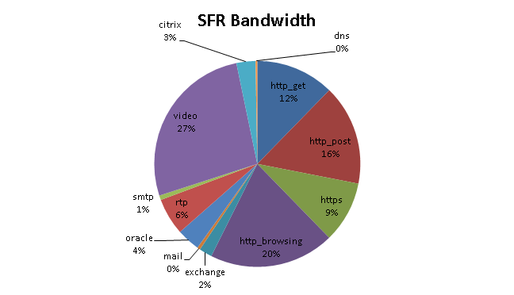

# Datasets 
Primero se ha realizado un analisis de los datasets disponibles actualmente ofrecidos por centros de investigación y universidades. 

## Datasets
En cuanto a datasets centrados en internet es importante tener en cuenta que HTTPS se empezó a promover por el WWW y EFF con el soporte de los exploradores en 2016, por lo que datasets anteriores no contienen el tráfico real actual. 
El tráfico HTTPS ahora mismo puede suponer más de un 70% del trafico de la red.

- **CAIDA (Center of Applied Internet Data Analysis)**:

Es un centro de investigación que se dedica al estudio y análisis de datos relacionados con Internet. 

4 areas de estudio:
- Proporcionar una visión macroscópica de la infraestructura, el comportamiento, el uso y la evolución de Internet.
- Fomentar un entorno de colaboración en el que los datos puedan adquirirse, analizarse y (en su caso) compartirse.
- Mejorar la integridad del campo de la ciencia de Internet.
- Informar las políticas públicas de ciencia, tecnología y comunicaciones.

https://www.linkedin.com/company/caida/?originalSubdomain=es

Por ejemplo un dataset de CAIDA de 2022 sería la siguiente:
https://catalog.caida.org/dataset/annotated_anonymized_telescope_packets_sampler

- **Waikato Internet Traffic Storage Project**:

Es una iniciativa desarrollada por el Departamento de Ciencias de la Computación de la Universidad de Waikato en Nueva Zelanda. El objetivo principal del proyecto es capturar, almacenar y analizar datos de tráfico de Internet en tiempo real.

- **TOTEM project**
https://totem.info.ucl.ac.be/dataset.html

- **Internet Traffic Archive**
https://ita.ee.lbl.gov/

- **UMass Trace repository**
https://traces.cs.umass.edu/

- **SimpleWeb** 
https://www.simpleweb.org/wiki/index.php/Traces

- **NSL-KDD**
Standard Latent Space Dimension For Network Intrusion Detection Systems Datasets

- **Twente** 
Como se ha mencionado antes, I. Sharafaldin et al. investigador de Twente recolecta información de su centro de investigación para poder generar un dataset. Otro dataset generado en el seno de esta Universidad es la encontrada en Anna Sperotto et al. (https://www.researchgate.net/publication/221262139_A_Labeled_Data_Set_for_Flow-Based_Intrusion_Detection/citations) la cual está etiquetada y es bastante realista para el año 2009. 

En la Universidad de Twente desarollaron el dataset **CIC-IDS2017**, basado en el B-Profile. 
https://www.unb.ca/cic/datasets/ids-2017.html

- **TRex CISCO**
El propio generador de tráfico Trex proporciona un dataset llamdo EMIX compuesto por:

  

 

(https://trex-tgn.cisco.com/trex/doc/trex_manual.html)

Se pueden encontrar más datasets como por ejemplo los ofrecidos por **MOME**, **CRAWDAD**, **RIPE**, **Kyoto** y **CDX**.
## Dataset propio

Al no encontrar ninguno dataset que provea de información relativa al controlador de una red SDN, se ha decidido crear uno utilizando como base unos de los mencionados anteriormente.
Para esto si ha requerido el generador de tráfico TRex de CISCO y algunos de los datasets anteriores. En especial se va a emplear el de **TRex CISCO** de EMIX y el tráfico benigno del lunes de **CIC-IDS2017**.
Se han elegido estos dos ya que estan muy bien documentados y son de facil acceso. 

### Metodología
A continuación se puede ver la metodología empleada para generar el dataset

C.J. Brandhorst (https://citeseerx.ist.psu.edu/document?repid=rep1&type=pdf&doi=da6341750d0c91917c5a1a66f7d4951da4bdc5b2) menciona los siguientes tres puntos clave de la métodología. 

- **Data**

Los datos tienen que existir y ser accessibles. 

- **Recolección**

Para poder recolectar dichos datos hay primero que identificar los puntos de recopilación de datos así como configurar la técina o herramienta de recopilación, esta puede ser un tcpdump por ejemplo. 
Después de esto hay que definir los filtros y parámetros de la captura para poder observar los paquetes más relevantes para el análisis. 
Ya una vez definidos los filtros se puede empezar con la captura de datos como tal. Ya una vez se han capturado los datos se deben registrar y almacenar por ejmplo en un archivo PCAP. En la captura de paquetes es recomendable anonimizar los datos por privacidad, de este modo solo se obtengan los datos de las cabeceras y se modifican algunas cabeceras para que no se sepa el origen y el destino.

Es importante también incluir algunos datos como la fecha y hora de inicio y de finalización de la captura, así como otra informaciñón relevante como la ubucación y el tipo de trafico. 

- **Analysis**

Los resultados se pueden utilizar para variables aplicaciones, para ello es importante analizarlas. Con el analisis se puede saber el tipo de tráfico y las tecnologias que se emplean en la red. 

I. Sharafaldin et al. en 2017 (https://www.researchgate.net/publication/318286637_Towards_a_Reliable_Intrusion_Detection_Benchmark_Dataset) comenta que tras hacer un analisis de el tráfico recolectado en su centro de investigación de la Universidad de Twente durante 1 mes los resultados han sido: 10% de tráfico http, 74% de https, 2% de ssh, 6% de ftp, 1% de email y 7% de otro tipo de tráfico.  

### Creación

- **Data**

Para generar los datos se va a utilizar el generador de tráfico TRex de CISCO. Para ello se va a emplear la topología creada en el escenario llamado "Complex" del repositorio vinculado llamado [Trex](https://github.com/LauSeVe/TRex/tree/main/TRexMininet/Complex). Por comodidad se ha reproducido el mismo escenario en la carpeta llamada "Topology". En esta carpeta se explica como se emplea este escenario para este caso de uso, más información generica se encuentra en el repositorio comentado anteriormente. 
