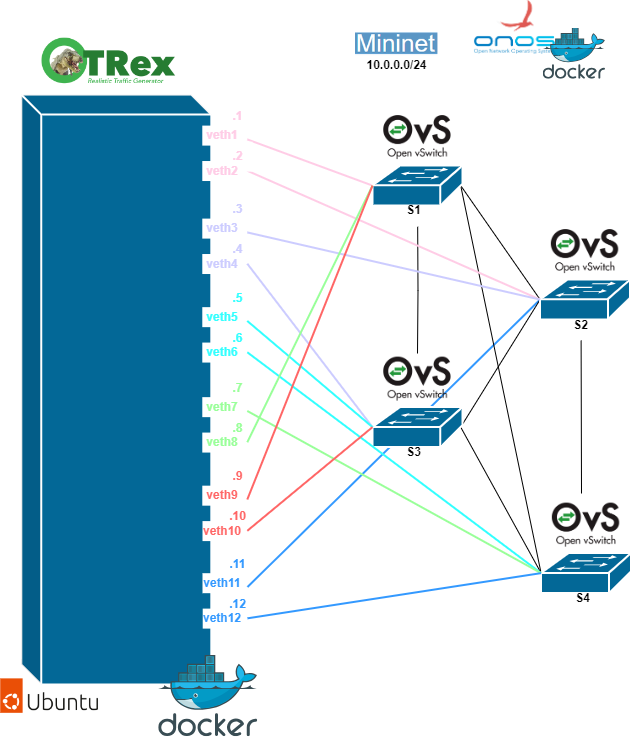

# TRex con Mininet y ONOS (Complex)
Este escenario está compuesta por una topología mininet de 4 switches y un contenedor con el generador de tráfico TRex de CISCO. Este contenedor tiene doce interfaces los cuales están conectados 2 a 2 a los switches de la topología Mininet.
El escenario es el siguiente.

  

## Desplegar ONOS y Mininet
El siguiente script despliega un contenedor con la imagen de ONOS, activa las aplicaciones necesarias para permitir el forwarding de mininet reactivo y genera una topologia con mininet.
~~~
sudo ./onos_docker.sh 
~~~
Se preguntará por la contraseña del usuario "karaf" para poder acceder a la consola de configuración de onos para activar las aplicaciones. karaf/karaf.

## TRex
Se construye la imagen de TRex 3.02 sobre un Ubuntu 20.04. (Este paso no es necesario realizarlo siempre).
~~~
docker build -t trex:20.04 .
~~~

Se despliega el contenedor con la imagen generada.
~~~
docker run --privileged --cap-add=ALL -v /mnt/huge:/mnt/huge -v /lib/modules:/lib/modules:ro -v /sys/bus/pci/devices:/sys/bus/pci/devices -v /sys/devices/system/node:/sys/devices/system/node -v /dev:/dev -it --name trex trex:20.04
~~~

## Configurar enlaces
El script "conf.sh" contiene todos los comandos necesarios para configurar los enlaces entre el TRex y la toplogía mininet de modo que el TRex está conectando los switches 2 a 2. 

## Captura del tráfico
Para capturar el tráfico se va a ejecutar el script de python llamado "interfaceONOS.py". 
Este primero busca el interfaz que está empleando el docker del controlador ONOS y luego captura en ese interfaz el tráfico empleando "tshark"
~~~
source interfaceONOS.py
~~~

Para capturar el tráfico del interfaz del docker con el controlador ONOS

Para ver los paquetes correspondientes al filtro
~~~
tshark -r test.pcap -Y "icmp.type==8 and openflow_v4.type==10"
~~~

## Lanzar tráfico con el TRex
Para lanzar el tráfico EMIX
~~~
sudo ./t-rex-64 -f avl/sfr_delay_10_1g.yaml
~~~

## Desconfiguración del escenario 
La topología mininet se puede eliminar escribiendo "exit" dentro de su terminal.
Para eliminar los contenedores:
~~~
docker rm -f onos trex
~~~
